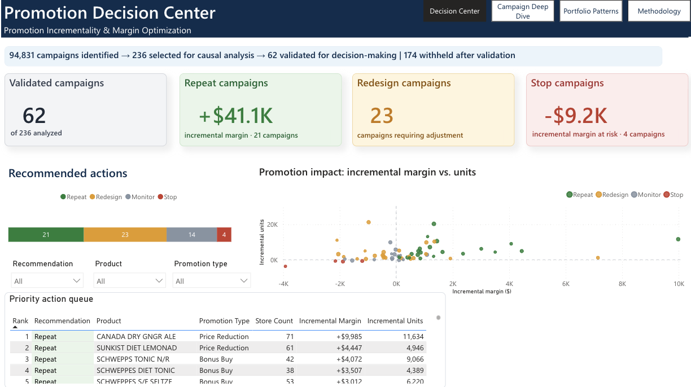
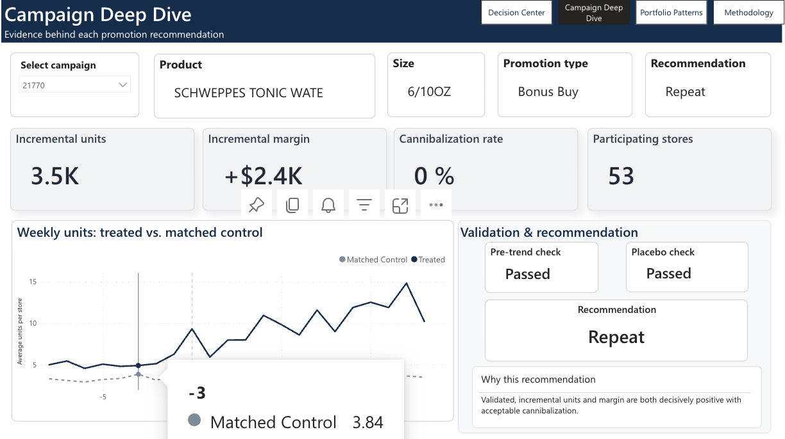
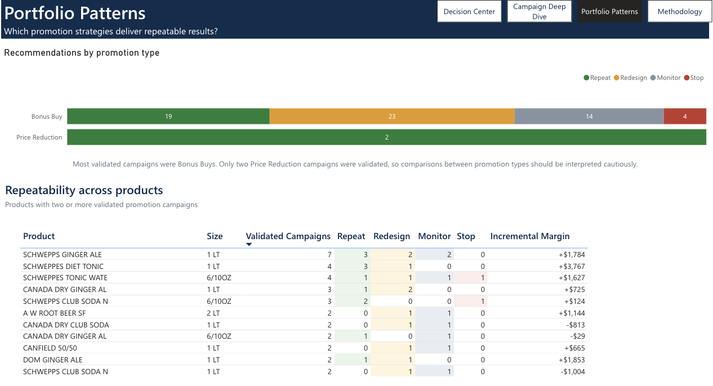
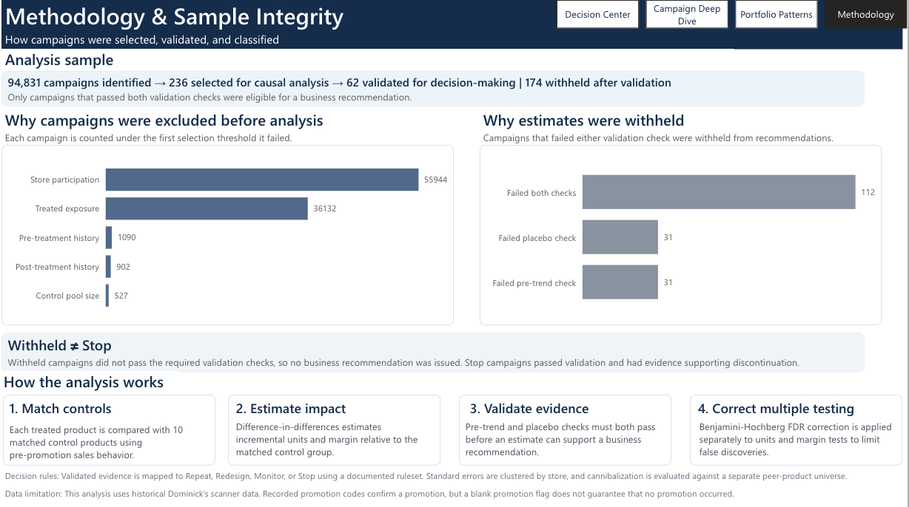

# Promotion Incrementality & Margin Optimization

A causal-inference pipeline and Power BI dashboard that determines which soft-drink promotion campaigns generated genuine incremental sales and margin, versus campaigns that only shifted demand or cannibalized other products in the same category.



## Executive Summary

Retailers run promotions constantly, but raw sales lift during a promotion is a poor measure of whether the promotion actually worked. Some of that lift is demand that would have happened anyway, and some of it is stolen from other products in the same category. This project applies a within-store, matched-control difference-in-differences design to historical Dominick's Finer Foods soft-drink scanner data to separate genuine incremental impact from that noise, then classifies each validated campaign into a clear business recommendation.

Of 94,831 candidate campaigns identified in the data, 236 met a set of identification-quality thresholds and were carried into causal analysis. Of those, 62 passed two validation checks and were eligible for a recommendation. The remaining 174 were withheld — not because the promotion failed, but because their effect could not be reliably isolated from other store activity. The results are presented in a four-page Power BI dashboard built for a merchandising decision-maker, not a statistics audience.

## Key Results

- **94,831** candidate campaigns identified → **236** passed identification-quality thresholds → **62** passed validation and were eligible for a recommendation → **174** withheld.
- Of the 62 validated campaigns: **21 Repeat**, **23 Redesign**, **14 Monitor**, **4 Stop**.
- Repeat campaigns: **+$41.1K** in incremental gross margin across those 21 campaigns.
- Stop campaigns: **-$9.2K** in incremental gross margin at risk across those 4 campaigns.
- All figures are estimated over each campaign's own promotion window and participating stores — not annualized, and not a company-wide total.

## Business Problem

A merchandising team runs far more promotions than it can evaluate carefully. The default way to judge a promotion — compare sales before and during — conflates three different effects: demand the promotion actually created, demand that would have occurred anyway, and demand pulled from other products in the same category. Treating all of that as promotional lift can lead to repeating campaigns with little evidence of incremental value or discontinuing campaigns whose true impact is obscured by broader demand changes.

This project asks a narrower, answerable question for the soft-drink category in the Dominick's dataset: for each promotion campaign, what portion of the observed sales change is attributable to the promotion itself, is it large enough and consistent enough to trust, and does it come at the cost of cannibalizing other products in the category.

## Dashboard

### Page 1 — Promotion Decision Center


Answers: what should we do? This page opens with the sample-integrity funnel so the scope of the analysis is never hidden, followed by recommendation KPIs, the Repeat/Redesign/Monitor/Stop distribution, an incremental margin vs. incremental units scatter colored by recommendation, and a priority action queue ordering campaigns by the documented decision priority. It is designed to be read in under two minutes without needing any statistical background.

### Page 2 — Campaign Deep Dive



Answers: why should I trust this specific recommendation? Selecting a single campaign surfaces its product and promotion context, incremental units and margin, cannibalization rate, participating store count, the observed treated-vs-matched-control weekly trajectory before and during the promotion, the pre-trend and placebo validation results, and the rule-generated reasoning behind the recommendation. This page exists so a specific decision can be defended, not just reported.

### Page 3 — Portfolio Patterns



Answers: do outcomes repeat across products and promotion mechanics, or was a given result a one-off? It shows the recommendation mix by promotion type and a repeatability view limited to products with two or more validated campaigns, so a recommendation can be checked against that product's own history rather than treated as a single isolated data point. Only two Price Reduction campaigns passed validation, and the page says so explicitly rather than implying a promotion-type comparison it can't support.

### Page 4 — Methodology & Sample Integrity



Answers: why should I trust the analytical process itself? This page lays out the 94,831 → 236 → 62 sample progression, which identification-quality threshold excluded each candidate campaign, how the 174 withheld campaigns split between failing the pre-trend check, the placebo check, or both, the distinction between Withheld and Stop, a plain-language summary of the method, the decision rules, and the data limitations. It exists for a technical reviewer or a skeptical stakeholder, and is one click away from every other page rather than the default view.

## Analytical Approach

Each promoted product is not compared to itself before and after the promotion. Instead, it is compared, in the same stores and the same weeks, to a set of similar products without a recorded promotion during the campaign window (the matched controls) — a difference-in-differences design. This matters because it separates the promotion's own effect from anything else moving demand for the whole category at the same time, which a simple before/after comparison cannot do.

A few design choices follow directly from that goal:

- **Matched controls, not a single benchmark.** Each treated product is compared against its 10 most similar eligible control products using pre-promotion sales pattern, level, trend, volatility, and price.
- **Store-clustered uncertainty.** Confidence ranges account for the fact that observations from the same store are not independent, so the analysis doesn't overstate how sure it is.
- **Two validation checks before any result is trusted.** A pre-trend check confirms the treated product and its controls were moving similarly before the promotion started. A placebo check applies the same estimation procedure to a pre-treatment window where no promotion effect should be present, testing whether the design detects a spurious effect. A campaign must pass both before its estimate is used for a recommendation.
- **Correction for testing many campaigns at once.** Because 236 campaigns are tested simultaneously, a Benjamini-Hochberg false-discovery-rate correction is applied — separately to the units result and the margin result, since they are different questions and answering one doesn't answer the other.
- **Cannibalization measured on a separate, broader universe.** Cannibalization is evaluated against the full set of same-category peer products, not against the 10 matched controls used for the causal estimate. Using the matched controls for both would be circular: those products are selected for being the most similar to the treated product, which also makes them the ones most likely to be cannibalized by it. When estimated incremental units are zero or negative, the cannibalization rate is undefined and reported as not applicable rather than as a misleading ratio.

## Sample & Validation

The analysis starts from 94,831 candidate campaigns, each a distinct product, timing, and promotion-mechanic combination reconstructed from the raw scanner data. Five sequential identification-quality thresholds — covering store participation, pre- and post-promotion data history, control-product availability, and total exposure — narrow that down to 236 campaigns meeting the predefined identification-quality requirements for causal estimation. Every excluded candidate is attributed to the first threshold it failed, in a fixed, documented order.

Of those 236, only 62 passed both the pre-trend and placebo validation checks described above. The other 174 were withheld from recommendation.
 **Withheld is not the same as Stop.** A withheld campaign's true effect is unknown — the design could not confidently isolate it from other store activity, which is a statement about measurement, not about the promotion's performance. A Stop recommendation, by contrast, means the campaign passed validation and the evidence points to a negative effect on both units and margin. Of the 174 withheld, 112 failed both checks, 31 failed the placebo check only, and 31 failed the pre-trend check only.

## Decision Framework

Every validated campaign is assigned one of four recommendations by a fixed, documented ruleset applied to its estimated effects — not by a trained machine learning classifier:

- **Repeat** — incremental units and incremental margin are both statistically significant after FDR correction, with confidence intervals entirely above zero and cannibalization within the acceptable threshold.
- **Redesign** — the campaign is valid but shows a clear economic trade-off: it either increases volume while reducing margin, or is positive on both metrics but exceeds the acceptable cannibalization threshold.
- **Monitor** — the campaign is valid, but the evidence is not statistically decisive on units and/or margin after FDR correction.
- **Stop** — incremental units and incremental margin are both statistically significant after FDR correction, with confidence intervals entirely below zero.

Internally, the pipeline's `decision_class` field uses `Keep`, `Redesign`, `Monitor`, `Kill`, and `Exclude`. The dashboard surfaces these as `Repeat`, `Redesign`, `Monitor`, `Stop`, and `Withheld` for a business audience.

## Pipeline & Repository Structure

```
.
├── python/                   # numbered analysis and reporting pipeline, 00–11
├── sql/                      # database setup and exploratory SQL
├── data/
│   ├── raw/                  # source data files
│   └── processed/            # generated analytical and Power BI reporting outputs
├── dashboard/                # final Power BI dashboard screenshots
├── docs/                     # data model and supporting project documentation
├── notebooks/                # exploratory analysis
├── config.py                 # shared paths and locked analytical thresholds
├── requirements.txt          # Python dependencies
└── README.md
```

| Stage | Script | Produces | Purpose |
|---|---|---|---|
| 0 | `00_week_decode.py` | `week_decode.csv` | Parses the week-number-to-calendar-date lookup from the Kilts Center codebook. |
| 1 | `01_load_raw_and_staging.py` | DuckDB staging tables | Loads and cleans the raw scanner data. |
| 2 | `02_build_campaigns.py` | `campaign_diagnostics.csv` | Constructs promotion campaigns and applies the identification-quality screening rules. |
| 3 | `03_control_availability.py` | `control_product_availability.csv` | Checks whether each campaign has enough eligible control products. |
| 4 | `04_match_controls.py` | `control_sets.csv` | Selects matched controls for the primary K=10 specification and sensitivity sets, including K=5, K=20, and a lower-cross-elasticity set. |
| 5 | `05_build_estimation_panels.py` | `fs_main_panel.pkl`, `fs_cann_panel.pkl` | Builds the store-week panels used for causal estimation and cannibalization analysis. |
| 6 | `06_estimate_effects.py` | `estimation_results.csv` | Estimates campaign-level Difference-in-Differences effects for units and margin, runs pre-trend and placebo validation, and calculates cannibalization. |
| 7 | `07_classify_campaigns.py` | `fact_promotion_campaign_effects_v1.csv` | Applies separate BH-FDR corrections to the units and margin test families, then assigns the locked campaign classifications. |
| 8 | `08_export_powerbi_metadata.py` | `dim_promotion_campaign.csv` | Exports display metadata for Power BI. |
| 9 | `09_export_powerbi_campaign_trends.py` | `fact_campaign_weekly_trends.csv` | Exports the weekly treated-vs-matched-control series used on Page 2. |
| 10 | `10_export_powerbi_product_consistency.py` | `fact_product_promotion_consistency.csv` | Exports the product repeatability rollup used on Page 3. |
| 11 | `11_export_powerbi_sample_funnel.py` | `fact_sample_funnel.csv` | Exports the sample-selection funnel used on Page 4. |

Stages 8 through 11 are reporting exports only. They read the outputs of Stages 0 through 7 and reshape them for Power BI; none of them recompute or alter a causal estimate, a validation result, or a decision classification.

## Reproducibility / Setup

Python 3.10+ is recommended.

Install the Python dependencies from `requirements.txt`:

```bash
pip install -r requirements.txt
```
To reproduce the pipeline, place the required Dominick's source files in `data/raw/` before execution:

- `weekly_sales.csv` — weekly store-level scanner data
- `products.csv` — product (UPC) lookup
- `Dominicks-Manual-and-Codebook_KiltsCenter.pdf` — the Kilts Center codebook, used to decode week numbers to calendar dates

Adjust `DATA_DIR` and `PROCESSED_DIR` in `config.py` if your local layout differs, then run the pipeline in order from the repository root:

```
python python/00_week_decode.py
python python/01_load_raw_and_staging.py
python python/02_build_campaigns.py
python python/03_control_availability.py
python python/04_match_controls.py
python python/05_build_estimation_panels.py
python python/06_estimate_effects.py
python python/07_classify_campaigns.py
python python/08_export_powerbi_metadata.py
python python/09_export_powerbi_campaign_trends.py
python python/10_export_powerbi_product_consistency.py
python python/11_export_powerbi_sample_funnel.py
```

The pipeline is designed to run sequentially: each stage consumes the raw inputs or outputs produced by earlier stages, while analytical outputs are written to `data/processed/` and the local DuckDB database as defined in `config.py`. The final Power BI model uses the locked Stage 7 campaign fact table together with the display-only reporting outputs from Stages 8–11.

## Data & Limitations

- The `SALE` field that flags a promotion is inconsistently recorded in the source data. A recorded promotion code confirms a promotion occurred; a blank value does not guarantee that no promotion occurred.
- The source data's promotion codes are B (Bonus Buy), S (simple price reduction), and C (Coupon). The final 236-campaign analytical sample contains Bonus Buy and Price Reduction campaigns; only these promotion types therefore appear in the final dashboard.
- Gross margin, as computed here, is not fully loaded net profit — trade spend, media costs, and other promotion costs are not observed in this dataset.
- The data is store-aggregate, not transaction- or basket-level, so individual customer substitution behavior cannot be measured directly. Cannibalization here is a category-level, not customer-level, effect.
- This is historical scanner data. The project demonstrates causal-inference methodology and decision-framework design, not a claim about current retail market conditions.
- Product descriptions come directly from the historical source data and may contain legacy abbreviations from the original point-of-sale system.

## Tech Stack

- **SQL / DuckDB** — staging, campaign construction, and analytical data management
- **Python** — pandas, NumPy, statsmodels, and pipeline/reporting automation
- **Power BI** — interactive decision dashboard and campaign-level exploration
- **Git / GitHub** — version control and project documentation

## Data Source / Attribution

This project uses the Dominick's Finer Foods scanner dataset, provided by the James M. Kilts Center for Marketing at the University of Chicago Booth School of Business, restricted to the soft-drink category.
